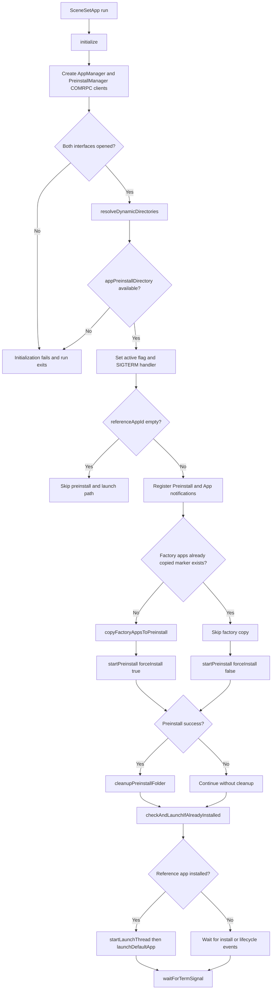
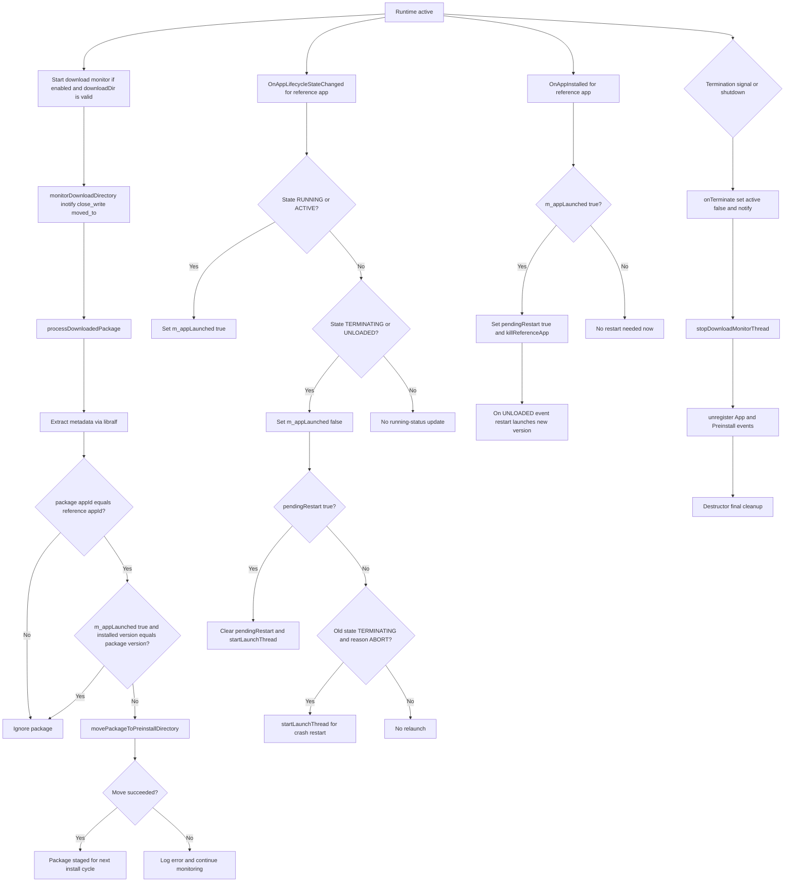

# SceneSet Architecture

SceneSet coordinates reference app launch, package preinstall, runtime lifecycle handling, and reference app update staging.

## Boot and Preinstall Flow



## Runtime Event and Update Flow



## Keep Diagram Editable and Generate PNG

Use Mermaid source as the single source of truth, then regenerate PNG whenever needed.

1. Save each diagram into Mermaid source files such as `docs/sceneset-boot-preinstall.mmd` and `docs/sceneset-runtime-update.mmd` if you want standalone render inputs.
2. Generate PNG from Mermaid sources:

```bash
npx @mermaid-js/mermaid-cli -i docs/sceneset-boot-preinstall.mmd -o docs/sceneset-boot-preinstall.png -t default -b white -s 2
npx @mermaid-js/mermaid-cli -i docs/sceneset-runtime-update.mmd -o docs/sceneset-runtime-update.png -t default -b white -s 2
```

3. Embed the generated PNG where needed.
4. For future updates, edit only Mermaid source and regenerate PNG.
