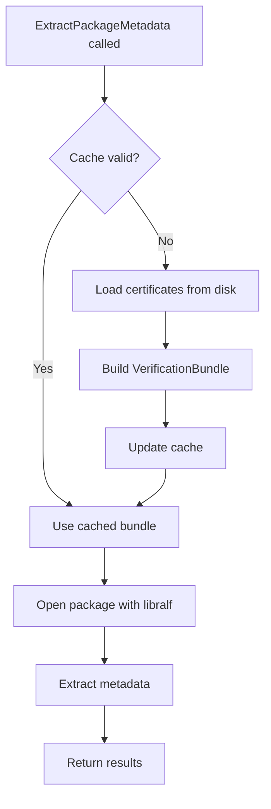
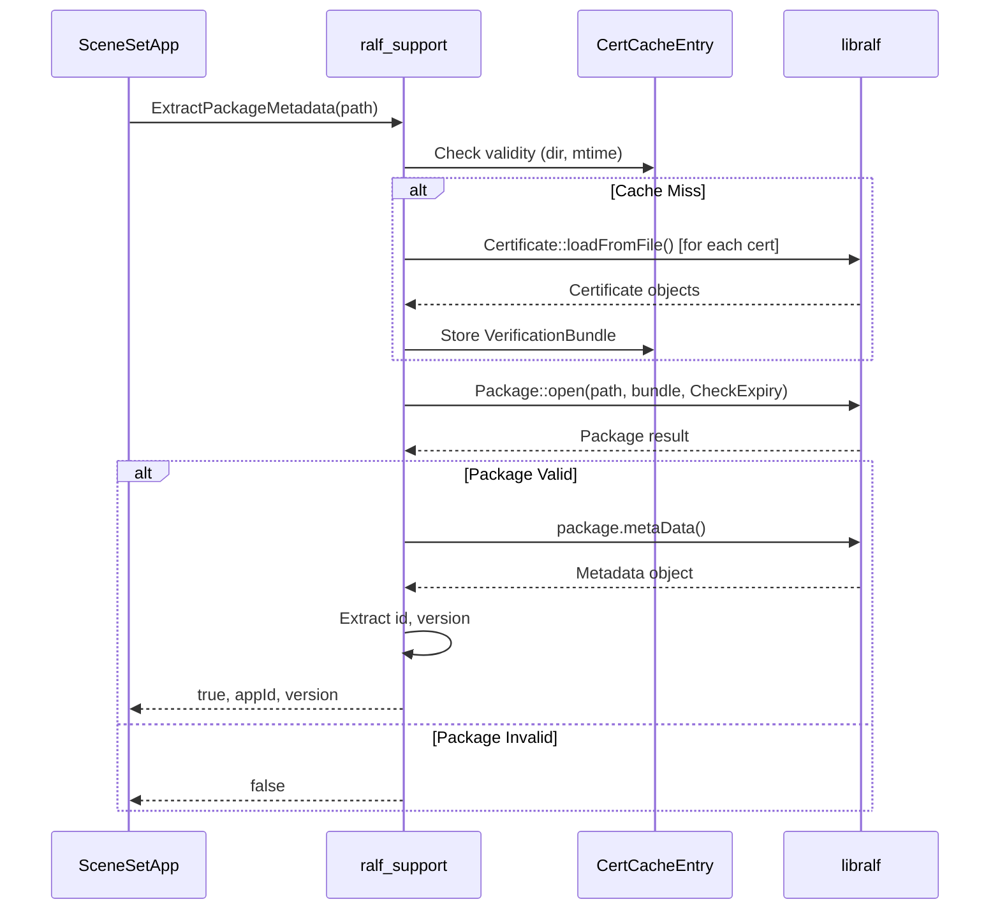

# RALF Package Support

## 1. High-Level Purpose

The `ralf_support` module provides a clean interface for verifying and extracting metadata from RALF (RDK Application Lifecycle Format) packages. It serves as the bridge between SceneSet and the external `libralf` library.

### Responsibilities

| Responsibility | Description |
|----------------|-------------|
| **Package Verification** | Validates RALF packages against trusted certificates |
| **Metadata Extraction** | Extracts app ID and version from package manifests |
| **Certificate Caching** | Thread-safe caching of verification bundles with mtime-based invalidation |

### What This Module Does NOT Do

- Does not download packages
- Does not install packages
- Does not manage certificates (only loads them)

---

## 2. File Organization

| File | Purpose |
|------|---------|
| `src/RalfPackageSupport.h` | Public API declarations |
| `src/RalfPackageSupport.cpp` | Implementation with libralf integration |

---

## 3. API Reference

### Namespace: `ralf_support`

#### `ExtractPackageMetadata()` (Full Signature)

```cpp
bool ExtractPackageMetadata(
    const std::filesystem::path& packagePath,
    const std::filesystem::path& certDir,
    std::string& packageAppId,
    std::string& packageVersion);
```

**Purpose:** Verifies a RALF package and extracts its metadata.

**Parameters:**

| Parameter | Type | Direction | Description |
|-----------|------|-----------|-------------|
| `packagePath` | `filesystem::path` | in | Path to the RALF package file |
| `certDir` | `filesystem::path` | in | Directory containing trusted certificates |
| `packageAppId` | `string` | out | Extracted application ID |
| `packageVersion` | `string` | out | Extracted version string |

**Returns:** `true` if verification and extraction succeeded, `false` otherwise.

**Error Conditions:**
- Certificate directory doesn't exist or is empty
- Package file doesn't exist or is invalid
- Package signature verification fails
- Metadata parsing fails

---

#### `ExtractPackageMetadata()` (Convenience Overload)

```cpp
bool ExtractPackageMetadata(
    const std::filesystem::path& packagePath,
    std::string& packageAppId,
    std::string& packageVersion);
```

**Purpose:** Convenience wrapper that uses the compile-time `DAC_APP_CERT_PATH` for the certificate directory.

**Implementation:**
```cpp
bool ExtractPackageMetadata(const std::filesystem::path& packagePath,
                            std::string& packageAppId,
                            std::string& packageVersion)
{
#ifndef DAC_APP_CERT_PATH
#error "DAC_APP_CERT_PATH must be defined, (CMake default: /etc/rdk/certs)."
#endif
    static const std::filesystem::path kCertDir(DAC_APP_CERT_PATH);
    return ExtractPackageMetadata(packagePath, kCertDir, packageAppId, packageVersion);
}
```

---

## 4. Internal Architecture

### Certificate Cache

The module implements a thread-safe certificate cache to avoid reloading certificates for every package verification.



### Cache Structure

```cpp
struct CertCacheEntry {
    std::filesystem::path dir;      // Cached certificate directory
    time_t mtime{0};                // Directory modification time
    bool valid{false};              // Cache validity flag
    std::shared_ptr<ralf::VerificationBundle> bundle;  // Loaded certificates
    size_t certCount{0};            // Number of certificates loaded
};
```

### Cache Invalidation

The cache is invalidated when:
1. Certificate directory path changes
2. Directory modification time (`mtime`) changes
3. First call (cache not yet populated)

**Thread Safety:** Cache access is protected by `g_certCacheMutex`.

---

## 5. Implementation Details

### Certificate Loading Process

```cpp
// Iterate certificate directory
std::filesystem::directory_iterator it(
    certDir,
    std::filesystem::directory_options::skip_permission_denied,
    certEc);

for (; it != end; it.increment(certEc)) {
    const auto& dirEntry = *it;
    
    // Skip non-regular files
    if (!dirEntry.is_regular_file(entryEc)) {
        continue;
    }
    
    // Load certificate from file
    auto certResult = ralf::Certificate::loadFromFile(dirEntry.path().string());
    if (certResult.is_error()) {
        std::cerr << "Failed to load certificate: " << dirEntry.path()
                  << " Error: " << certResult.error().what() << std::endl;
        continue;
    }
    
    newBundle->addCertificate(certResult.value());
    ++newCertCount;
}
```

### Package Verification

```cpp
// Open and verify package
auto packageResult = ralf::Package::open(
    packagePath, 
    *verificationBundlePtr, 
    ralf::Package::OpenFlags::CheckCertificateExpiry);

if (packageResult.is_error()) {
    std::cerr << "Failed to open/verify package: " << packagePath
              << " Error: " << packageResult.error().what() << std::endl;
    return false;
}
```

### Metadata Extraction

```cpp
auto metadataResult = packageResult.value().metaData();
if (metadataResult.is_error()) {
    std::cerr << "Failed to parse package metadata: " << packagePath
              << " Error: " << metadataResult.error().what() << std::endl;
    return false;
}

const auto& metadata = metadataResult.value();
if (!metadata.isValid()) {
    return false;
}

packageAppId = metadata.id();
packageVersion = metadata.version().toString();
if (packageVersion.empty()) {
    packageVersion = metadata.versionName();
}
```

---

## 6. Sequence Diagram



---

## 7. Error Handling

The module uses comprehensive error handling with detailed logging:

| Error Condition | Handling | Log Level |
|-----------------|----------|-----------|
| Certificate load failure | Skip cert, continue | `cerr` |
| No certificates loaded | Return false | `cerr` |
| Package open failure | Return false | `cerr` |
| Metadata parse failure | Return false | `cerr` |
| Invalid metadata | Return false | (silent) |
| Directory iteration error | Log and break | `cerr` |
| Filesystem errors | Catch and return false | `cerr` |

---

## 8. Testing Considerations

### Test Hook for Metadata Extractor

SceneSet provides a test hook to inject mock metadata extractors:

```cpp
#ifdef UNIT_TEST
void SceneSetApp::setMetadataExtractorForTesting(
    bool (*extractor)(const std::filesystem::path&, std::string&, std::string&)) {
    g_metadataExtractor = (extractor != nullptr) 
        ? extractor 
        : static_cast<MetadataExtractor>(&ralf_support::ExtractPackageMetadata);
}

void SceneSetApp::resetMetadataExtractorForTesting() {
    g_metadataExtractor = static_cast<MetadataExtractor>(&ralf_support::ExtractPackageMetadata);
}
#endif
```

This allows unit tests to:
- Bypass actual RALF verification
- Simulate various package scenarios
- Test error handling paths

---

## 9. Build Configuration

### Required CMake Variable

```cmake
if(NOT DAC_APP_CERT_PATH)
    message(WARNING "DAC_APP_CERT_PATH is not set, using default value /etc/rdk/certs")
    set(DAC_APP_CERT_PATH "/etc/rdk/certs" CACHE STRING "DAC app certificate path")
endif()
```

### Compile Definition

```cmake
target_compile_definitions(${TARGET} PRIVATE
    DAC_APP_CERT_PATH="${DAC_APP_CERT_PATH}"
)
```

### libralf Linking

The build system supports multiple libralf target configurations:

```cmake
if(TARGET ralf-utils::libralf)
    target_link_libraries(${TARGET} PRIVATE ralf-utils::libralf)
elseif(TARGET libralf)
    target_link_libraries(${TARGET} PRIVATE libralf)
elseif(TARGET ralf-utils::libralf-static)
    target_link_libraries(${TARGET} PRIVATE ralf-utils::libralf-static)
elseif(TARGET libralf-static)
    target_link_libraries(${TARGET} PRIVATE libralf-static)
else()
    message(FATAL_ERROR "libralf package found but no usable CMake target exported")
endif()
```

---

## 10. Security Considerations

| Aspect | Implementation |
|--------|----------------|
| **Certificate Expiry** | Enabled via `ralf::Package::OpenFlags::CheckCertificateExpiry` |
| **Symlink Protection** | Package verification rejects symlinks |
| **Cache Isolation** | Mutex-protected; per-directory caching prevents cross-contamination |
| **Error Disclosure** | Detailed errors logged locally; minimal info returned to callers |

---

## Next Steps

- [Configuration Guide](./configuration.md) — Build and runtime configuration
- [Core Components](./core-components.md) — How SceneSet uses RALF support
