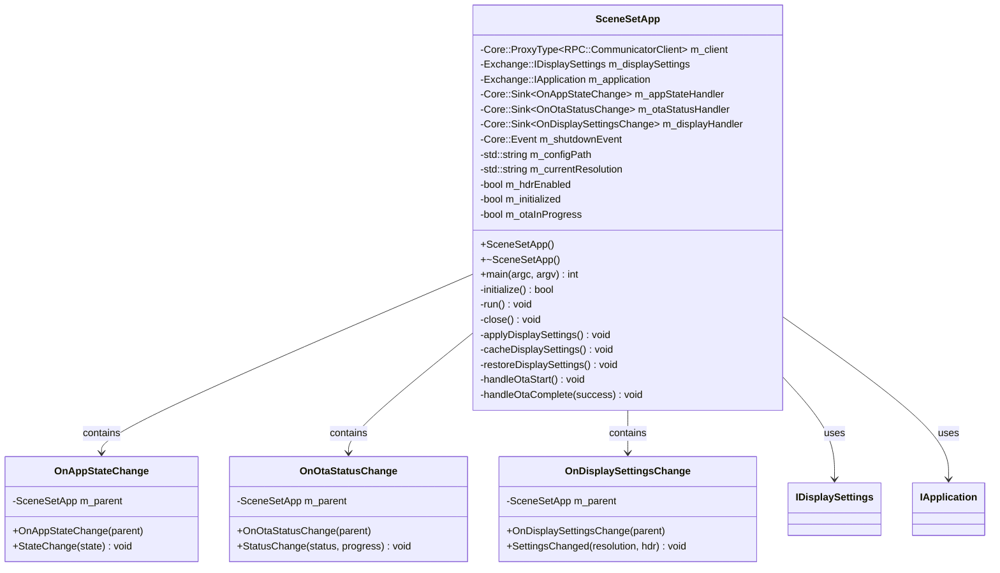
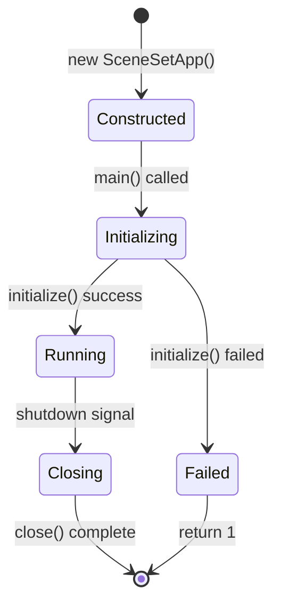
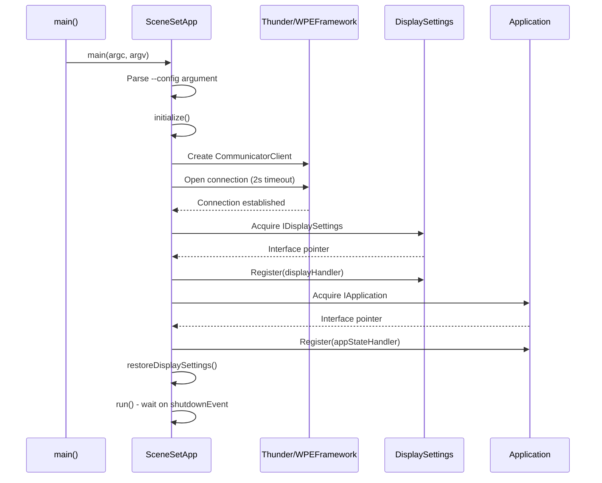
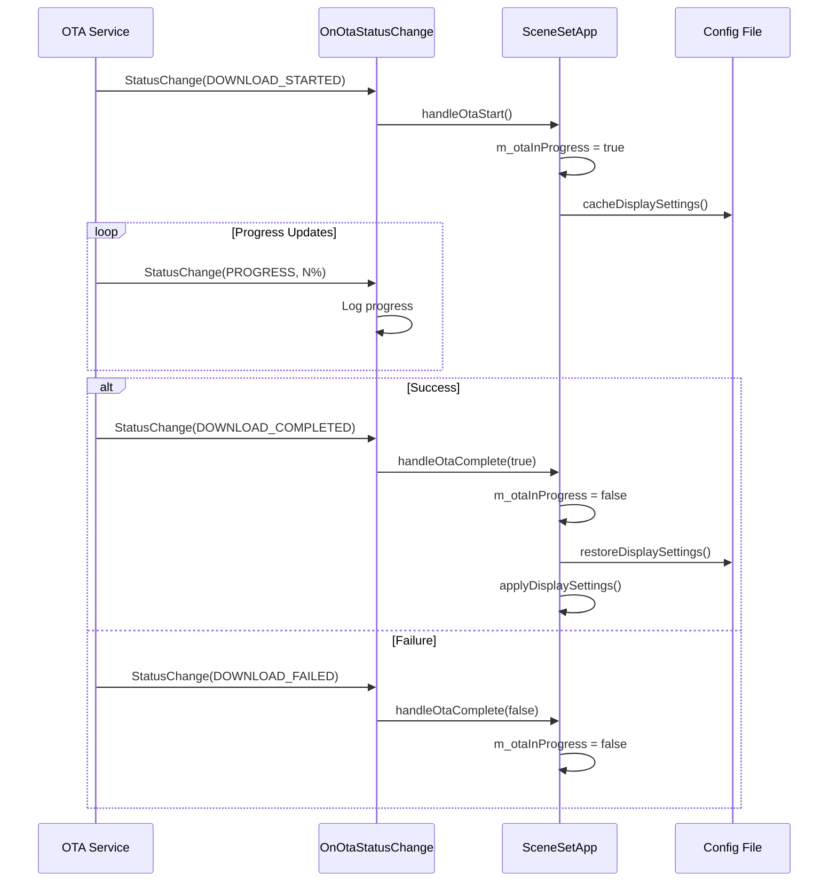

# SceneSet Source Code Documentation

> **Location**: `src/` folder  
> **Primary Files**: `SceneSet.h`, `SceneSet.cpp`, `main.cpp`  
> **Purpose**: Thunder COM-RPC client service that coordinates app preinstall and launches/monitors the configured reference app via AppManager/PreinstallManager/PackageInstaller

---

## Table of Contents

1. [Overview](#overview)
2. [File Structure](#file-structure)
3. [main.cpp](#maincpp)
4. [SceneSet.h](#sceneseth)
5. [SceneSet.cpp](#scenesetcpp)
6. [Class Diagram](#class-diagram)
7. [Event Handler Classes](#event-handler-classes)
8. [Member Variables Reference](#member-variables-reference)
9. [Method Reference](#method-reference)
10. [Execution Flow](#execution-flow)
11. [Code Snippets](#code-snippets)

---

## Overview

The `src/` folder contains the complete implementation of the SceneSet application—a Thunder COM-RPC client service responsible for:

- Coordinating application preinstall at startup (including first-boot factory app copy)
- Launching the configured reference app and reacting to AppManager lifecycle events
- Monitoring the package download directory and feeding packages into the preinstall flow
- Integrating with systemd readiness notification and graceful termination handling

### Technology Stack

| Component | Technology |
|-----------|------------|
| Framework | Thunder NanoServices (WPEFramework) |
| Language | C++11/14 |
| Threading | Single-threaded event loop |
| IPC | Thunder COM-RPC / JSON-RPC |
| Package Verification | libralf (optional) |

---

## File Structure

```
src/
├── main.cpp          # Application entry point
├── SceneSet.h        # Class declaration and nested event handlers
└── SceneSet.cpp      # Full implementation of SceneSetApp
```

| File | Lines | Purpose |
|------|-------|---------|
| `main.cpp` | ~30 | Entry point, argument parsing, app instantiation |
| `SceneSet.h` | ~150 | Header with class definition, nested classes, member declarations |
| `SceneSet.cpp` | ~350 | Complete implementation of all methods and event handlers |

---

## main.cpp

### Purpose

The entry point for the SceneSet application. Responsible for:
- Parsing command-line arguments
- Creating the `SceneSetApp` instance
- Invoking the main application loop

### Complete Source

```cpp
// filepath: src/main.cpp
#include "SceneSet.h"

int main(int argc, char* argv[])
{
    SceneSetApp app;
    return app.main(argc, argv);
}
```

### Explanation

| Line | Description |
|------|-------------|
| `#include "SceneSet.h"` | Includes the SceneSetApp class declaration |
| `SceneSetApp app;` | Creates application instance on stack |
| `app.main(argc, argv)` | Delegates to SceneSetApp::main() which handles initialization, event loop, and shutdown |

### Dependencies

- **SceneSet.h**: Provides `SceneSetApp` class definition

---

## SceneSet.h

### Purpose

Header file declaring the `SceneSetApp` class and its nested event handler classes.

### Include Dependencies

```cpp
// filepath: src/SceneSet.h (includes section)
#include <core/core.h>
#include <com/com.h>
#include <plugins/plugins.h>
#include <interfaces/IDisplaySettings.h>
#include <interfaces/IApplication.h>

#ifdef HAS_RALF_SUPPORT
#include <ralf.h>
#endif
```

| Include | Purpose |
|---------|---------|
| `<core/core.h>` | Thunder core utilities (strings, threads, sync) |
| `<com/com.h>` | Thunder COM-RPC communication |
| `<plugins/plugins.h>` | Plugin infrastructure |
| `<interfaces/IDisplaySettings.h>` | Display settings interface definitions |
| `<interfaces/IApplication.h>` | Application lifecycle interface |
| `<ralf.h>` | RALF package verification (conditional) |

### Namespace

```cpp
namespace WPEFramework {
namespace Plugin {
    class SceneSetApp { ... };
}
}
```

### Class Declaration Overview

```cpp
// filepath: src/SceneSet.h
class SceneSetApp {
public:
    SceneSetApp();
    ~SceneSetApp();

    int main(int argc, char* argv[]);

private:
    // Nested event handler classes
    class OnAppStateChange;
    class OnOtaStatusChange;
    class OnDisplaySettingsChange;

    // Initialization and lifecycle
    bool initialize();
    void run();
    void close();

    // Display settings operations
    void applyDisplaySettings();
    void cacheDisplaySettings();
    void restoreDisplaySettings();

    // OTA handling
    void handleOtaStart();
    void handleOtaComplete(bool success);

    // RALF support (conditional)
#ifdef HAS_RALF_SUPPORT
    bool verifyPackage(const std::string& packagePath);
    void clearCertificateCache();
#endif

    // Member variables
    Core::ProxyType<RPC::CommunicatorClient> m_client;
    Exchange::IDisplaySettings* m_displaySettings;
    Exchange::IApplication* m_application;
    Core::Sink<OnAppStateChange> m_appStateHandler;
    Core::Sink<OnOtaStatusChange> m_otaStatusHandler;
    Core::Sink<OnDisplaySettingsChange> m_displayHandler;
    Core::Event m_shutdownEvent;
    std::string m_configPath;
    std::string m_currentResolution;
    bool m_hdrEnabled;
    bool m_initialized;
    bool m_otaInProgress;

#ifdef HAS_RALF_SUPPORT
    std::map<std::string, CertificateInfo> m_certificateCache;
#endif
};
```

---

## SceneSet.cpp

### Purpose

Complete implementation of the `SceneSetApp` class including:
- Application lifecycle management
- Thunder service connections
- Event handler implementations
- Display settings caching and restoration
- OTA firmware update coordination

### Include Section

```cpp
// filepath: src/SceneSet.cpp
#include "SceneSet.h"
#include <fstream>
#include <sstream>

namespace WPEFramework {
namespace Plugin {

using namespace Exchange;
```

---

## Class Diagram



---

## Event Handler Classes

### OnAppStateChange

Handles application lifecycle state transitions from the Thunder Application service.

```cpp
// filepath: src/SceneSet.cpp (OnAppStateChange implementation)
class SceneSetApp::OnAppStateChange : public Exchange::IApplication::INotification {
public:
    OnAppStateChange(SceneSetApp& parent)
        : m_parent(parent)
    {
    }

    void StateChange(const Exchange::IApplication::state newState) override
    {
        switch (newState) {
        case Exchange::IApplication::state::ACTIVATED:
            TRACE_L1("Application activated - restoring display settings");
            m_parent.restoreDisplaySettings();
            break;

        case Exchange::IApplication::state::DEACTIVATED:
            TRACE_L1("Application deactivated - caching display settings");
            m_parent.cacheDisplaySettings();
            break;

        case Exchange::IApplication::state::SUSPENDED:
            TRACE_L1("Application suspended");
            break;

        default:
            TRACE_L2("Unknown state: %d", static_cast<int>(newState));
            break;
        }
    }

    BEGIN_INTERFACE_MAP(OnAppStateChange)
        INTERFACE_ENTRY(Exchange::IApplication::INotification)
    END_INTERFACE_MAP

private:
    SceneSetApp& m_parent;
};
```

| State | Action |
|-------|--------|
| `ACTIVATED` | Restores cached display settings |
| `DEACTIVATED` | Caches current display settings |
| `SUSPENDED` | Logs suspension (no action) |

---

### OnOtaStatusChange

Monitors OTA firmware update status and coordinates display settings during updates.

```cpp
// filepath: src/SceneSet.cpp (OnOtaStatusChange implementation)
class SceneSetApp::OnOtaStatusChange : public Exchange::IOta::INotification {
public:
    OnOtaStatusChange(SceneSetApp& parent)
        : m_parent(parent)
    {
    }

    void StatusChange(const Exchange::IOta::Status status,
                      const uint8_t progress) override
    {
        switch (status) {
        case Exchange::IOta::Status::DOWNLOAD_STARTED:
            TRACE_L1("OTA download started");
            m_parent.handleOtaStart();
            break;

        case Exchange::IOta::Status::DOWNLOAD_PROGRESS:
            TRACE_L2("OTA progress: %u%%", progress);
            break;

        case Exchange::IOta::Status::DOWNLOAD_COMPLETED:
            TRACE_L1("OTA download completed successfully");
            m_parent.handleOtaComplete(true);
            break;

        case Exchange::IOta::Status::DOWNLOAD_FAILED:
            TRACE_L1("OTA download failed");
            m_parent.handleOtaComplete(false);
            break;

        default:
            break;
        }
    }

    BEGIN_INTERFACE_MAP(OnOtaStatusChange)
        INTERFACE_ENTRY(Exchange::IOta::INotification)
    END_INTERFACE_MAP

private:
    SceneSetApp& m_parent;
};
```

| Status | Action |
|--------|--------|
| `DOWNLOAD_STARTED` | Calls `handleOtaStart()` to cache settings |
| `DOWNLOAD_PROGRESS` | Logs progress percentage |
| `DOWNLOAD_COMPLETED` | Calls `handleOtaComplete(true)` |
| `DOWNLOAD_FAILED` | Calls `handleOtaComplete(false)` |

---

### OnDisplaySettingsChange

Receives notifications when display settings change externally.

```cpp
// filepath: src/SceneSet.cpp (OnDisplaySettingsChange implementation)
class SceneSetApp::OnDisplaySettingsChange : public Exchange::IDisplaySettings::INotification {
public:
    OnDisplaySettingsChange(SceneSetApp& parent)
        : m_parent(parent)
    {
    }

    void SettingsChanged(const string& resolution, const bool hdrEnabled) override
    {
        TRACE_L1("Display settings changed: resolution=%s, HDR=%s",
                 resolution.c_str(), hdrEnabled ? "enabled" : "disabled");

        m_parent.m_currentResolution = resolution;
        m_parent.m_hdrEnabled = hdrEnabled;

        // Cache the new settings
        m_parent.cacheDisplaySettings();
    }

    BEGIN_INTERFACE_MAP(OnDisplaySettingsChange)
        INTERFACE_ENTRY(Exchange::IDisplaySettings::INotification)
    END_INTERFACE_MAP

private:
    SceneSetApp& m_parent;
};
```

| Event | Action |
|-------|--------|
| Settings changed | Updates internal state and caches to persistent storage |

---

## Member Variables Reference

### Connection & Interface Members

| Variable | Type | Description |
|----------|------|-------------|
| `m_client` | `Core::ProxyType<RPC::CommunicatorClient>` | Thunder COM-RPC client connection |
| `m_displaySettings` | `Exchange::IDisplaySettings*` | Interface to DisplaySettings service |
| `m_application` | `Exchange::IApplication*` | Interface to Application lifecycle service |

### Event Handler Sinks

| Variable | Type | Description |
|----------|------|-------------|
| `m_appStateHandler` | `Core::Sink<OnAppStateChange>` | Receives app state notifications |
| `m_otaStatusHandler` | `Core::Sink<OnOtaStatusChange>` | Receives OTA status notifications |
| `m_displayHandler` | `Core::Sink<OnDisplaySettingsChange>` | Receives display change notifications |

### State & Configuration

| Variable | Type | Default | Description |
|----------|------|---------|-------------|
| `m_shutdownEvent` | `Core::Event` | N/A | Signals shutdown to event loop |
| `m_configPath` | `std::string` | `"/opt/sceneset/config.json"` | Path to config file |
| `m_currentResolution` | `std::string` | `"1080p"` | Current display resolution |
| `m_hdrEnabled` | `bool` | `false` | HDR enabled state |
| `m_initialized` | `bool` | `false` | Initialization complete flag |
| `m_otaInProgress` | `bool` | `false` | OTA update in progress flag |

### RALF Support (Conditional)

| Variable | Type | Description |
|----------|------|-------------|
| `m_certificateCache` | `std::map<std::string, CertificateInfo>` | Cached certificate validation results |

---

## Method Reference

### Public Methods

#### `SceneSetApp::SceneSetApp()`

**Constructor** - Initializes member variables to default states.

```cpp
// filepath: src/SceneSet.cpp
SceneSetApp::SceneSetApp()
    : m_client()
    , m_displaySettings(nullptr)
    , m_application(nullptr)
    , m_appStateHandler(*this)
    , m_otaStatusHandler(*this)
    , m_displayHandler(*this)
    , m_shutdownEvent(false, true)
    , m_configPath("/opt/sceneset/config.json")
    , m_currentResolution("1080p")
    , m_hdrEnabled(false)
    , m_initialized(false)
    , m_otaInProgress(false)
{
    TRACE_L1("SceneSetApp constructed");
}
```

---

#### `SceneSetApp::~SceneSetApp()`

**Destructor** - Ensures cleanup via `close()`.

```cpp
// filepath: src/SceneSet.cpp
SceneSetApp::~SceneSetApp()
{
    close();
    TRACE_L1("SceneSetApp destroyed");
}
```

---

#### `int SceneSetApp::main(int argc, char* argv[])`

**Entry point** - Parses arguments, initializes, runs event loop, and cleans up.

```cpp
// filepath: src/SceneSet.cpp
int SceneSetApp::main(int argc, char* argv[])
{
    int result = 0;

    // Parse command line arguments
    for (int i = 1; i < argc; i++) {
        std::string arg(argv[i]);
        if (arg == "--config" && (i + 1) < argc) {
            m_configPath = argv[++i];
        }
    }

    TRACE_L1("SceneSet starting with config: %s", m_configPath.c_str());

    if (initialize()) {
        run();
        result = 0;
    } else {
        TRACE_L1("Failed to initialize SceneSet");
        result = 1;
    }

    close();
    return result;
}
```

**Parameters:**
| Parameter | Description |
|-----------|-------------|
| `argc` | Argument count |
| `argv` | Argument values (supports `--config <path>`) |

**Return:** `0` on success, `1` on initialization failure.

---

### Private Methods

#### `bool SceneSetApp::initialize()`

**Initialization** - Connects to Thunder, acquires service interfaces, registers event handlers.

```cpp
// filepath: src/SceneSet.cpp
bool SceneSetApp::initialize()
{
    bool success = false;

    // Create Thunder client connection
    m_client = Core::ProxyType<RPC::CommunicatorClient>::Create(
        Core::NodeId("/tmp/communicator", 0),
        Core::ProxyType<Core::IIPCServer>::Create()
    );

    if (m_client.IsValid() && m_client->Open(2000) == Core::ERROR_NONE) {
        
        // Acquire DisplaySettings interface
        m_displaySettings = m_client->Acquire<Exchange::IDisplaySettings>(
            2000, _T("DisplaySettings"), ~0);

        if (m_displaySettings != nullptr) {
            m_displaySettings->Register(&m_displayHandler);

            // Acquire Application interface
            m_application = m_client->Acquire<Exchange::IApplication>(
                2000, _T("Application"), ~0);

            if (m_application != nullptr) {
                m_application->Register(&m_appStateHandler);
                
                // Load cached settings
                restoreDisplaySettings();
                
                m_initialized = true;
                success = true;
                TRACE_L1("SceneSet initialized successfully");
            } else {
                TRACE_L1("Failed to acquire Application interface");
            }
        } else {
            TRACE_L1("Failed to acquire DisplaySettings interface");
        }
    } else {
        TRACE_L1("Failed to connect to Thunder");
    }

    return success;
}
```

**Sequence:**
1. Create COM-RPC client
2. Connect to Thunder (2s timeout)
3. Acquire `IDisplaySettings` interface
4. Register display change handler
5. Acquire `IApplication` interface
6. Register app state handler
7. Restore cached settings
8. Set `m_initialized = true`

---

#### `void SceneSetApp::run()`

**Event loop** - Waits for shutdown signal.

```cpp
// filepath: src/SceneSet.cpp
void SceneSetApp::run()
{
    TRACE_L1("SceneSet entering main loop");

    // Wait for shutdown signal
    m_shutdownEvent.Lock();

    TRACE_L1("SceneSet exiting main loop");
}
```

**Behavior:** Blocks on `m_shutdownEvent` until signaled by external shutdown request.

---

#### `void SceneSetApp::close()`

**Cleanup** - Unregisters handlers, releases interfaces, disconnects client.

```cpp
// filepath: src/SceneSet.cpp
void SceneSetApp::close()
{
    if (m_initialized) {
        // Unregister notification handlers
        if (m_application != nullptr) {
            m_application->Unregister(&m_appStateHandler);
            m_application->Release();
            m_application = nullptr;
        }

        if (m_displaySettings != nullptr) {
            m_displaySettings->Unregister(&m_displayHandler);
            m_displaySettings->Release();
            m_displaySettings = nullptr;
        }

        // Close client connection
        if (m_client.IsValid()) {
            m_client->Close(Core::infinite);
            m_client.Release();
        }

        m_initialized = false;
        TRACE_L1("SceneSet closed");
    }
}
```

**Cleanup Sequence:**
1. Unregister app state handler
2. Release `IApplication` interface
3. Unregister display handler
4. Release `IDisplaySettings` interface
5. Close and release COM-RPC client

---

#### `void SceneSetApp::applyDisplaySettings()`

**Apply settings** - Sends current resolution and HDR state to DisplaySettings service.

```cpp
// filepath: src/SceneSet.cpp
void SceneSetApp::applyDisplaySettings()
{
    if (m_displaySettings != nullptr) {
        uint32_t result = m_displaySettings->SetResolution(m_currentResolution);
        if (result == Core::ERROR_NONE) {
            TRACE_L1("Resolution set to: %s", m_currentResolution.c_str());
        }

        result = m_displaySettings->SetHDR(m_hdrEnabled);
        if (result == Core::ERROR_NONE) {
            TRACE_L1("HDR set to: %s", m_hdrEnabled ? "enabled" : "disabled");
        }
    }
}
```

---

#### `void SceneSetApp::cacheDisplaySettings()`

**Cache to file** - Persists current settings to JSON config file.

```cpp
// filepath: src/SceneSet.cpp
void SceneSetApp::cacheDisplaySettings()
{
    std::ofstream file(m_configPath);
    if (file.is_open()) {
        file << "{\n";
        file << "  \"resolution\": \"" << m_currentResolution << "\",\n";
        file << "  \"hdrEnabled\": " << (m_hdrEnabled ? "true" : "false") << "\n";
        file << "}\n";
        file.close();
        TRACE_L1("Display settings cached to: %s", m_configPath.c_str());
    } else {
        TRACE_L1("Failed to cache display settings to: %s", m_configPath.c_str());
    }
}
```

**Output Format:**
```json
{
  "resolution": "1080p",
  "hdrEnabled": false
}
```

---

#### `void SceneSetApp::restoreDisplaySettings()`

**Restore from file** - Reads cached settings and applies them.

```cpp
// filepath: src/SceneSet.cpp
void SceneSetApp::restoreDisplaySettings()
{
    std::ifstream file(m_configPath);
    if (file.is_open()) {
        std::stringstream buffer;
        buffer << file.rdbuf();
        std::string content = buffer.str();
        file.close();

        // Simple JSON parsing (production code should use proper JSON library)
        size_t resPos = content.find("\"resolution\"");
        if (resPos != std::string::npos) {
            size_t start = content.find("\"", resPos + 12) + 1;
            size_t end = content.find("\"", start);
            m_currentResolution = content.substr(start, end - start);
        }

        size_t hdrPos = content.find("\"hdrEnabled\"");
        if (hdrPos != std::string::npos) {
            m_hdrEnabled = (content.find("true", hdrPos) != std::string::npos);
        }

        TRACE_L1("Restored settings: resolution=%s, HDR=%s",
                 m_currentResolution.c_str(), m_hdrEnabled ? "enabled" : "disabled");

        applyDisplaySettings();
    } else {
        TRACE_L2("No cached settings found at: %s", m_configPath.c_str());
    }
}
```

---

#### `void SceneSetApp::handleOtaStart()`

**OTA start handler** - Caches settings before firmware update begins.

```cpp
// filepath: src/SceneSet.cpp
void SceneSetApp::handleOtaStart()
{
    m_otaInProgress = true;
    cacheDisplaySettings();
    TRACE_L1("OTA started - display settings cached");
}
```

---

#### `void SceneSetApp::handleOtaComplete(bool success)`

**OTA complete handler** - Restores settings after firmware update.

```cpp
// filepath: src/SceneSet.cpp
void SceneSetApp::handleOtaComplete(bool success)
{
    m_otaInProgress = false;

    if (success) {
        TRACE_L1("OTA completed successfully - restoring display settings");
        restoreDisplaySettings();
    } else {
        TRACE_L1("OTA failed - display settings remain cached");
    }
}
```

---

### RALF Support Methods (Conditional)

#### `bool SceneSetApp::verifyPackage(const std::string& packagePath)`

**Package verification** - Validates OTA package signatures using libralf.

```cpp
// filepath: src/SceneSet.cpp
#ifdef HAS_RALF_SUPPORT
bool SceneSetApp::verifyPackage(const std::string& packagePath)
{
    // Check certificate cache first
    auto it = m_certificateCache.find(packagePath);
    if (it != m_certificateCache.end()) {
        TRACE_L1("Using cached certificate verification for: %s", packagePath.c_str());
        return it->second.isValid;
    }

    // Perform verification
    ralf_context_t* ctx = ralf_init();
    if (ctx == nullptr) {
        TRACE_L1("Failed to initialize RALF context");
        return false;
    }

    bool result = (ralf_verify_package(ctx, packagePath.c_str()) == RALF_SUCCESS);

    // Cache the result
    CertificateInfo info;
    info.isValid = result;
    info.timestamp = time(nullptr);
    m_certificateCache[packagePath] = info;

    ralf_cleanup(ctx);

    TRACE_L1("Package verification %s: %s",
             result ? "succeeded" : "failed", packagePath.c_str());
    return result;
}
#endif
```

---

#### `void SceneSetApp::clearCertificateCache()`

**Clear cache** - Removes all cached certificate verification results.

```cpp
// filepath: src/SceneSet.cpp
#ifdef HAS_RALF_SUPPORT
void SceneSetApp::clearCertificateCache()
{
    m_certificateCache.clear();
    TRACE_L1("Certificate cache cleared");
}
#endif
```

---

## Execution Flow

### Application Lifecycle



### Startup Sequence



### OTA Update Flow



---

## Code Snippets

### Complete Initialization Flow

```cpp
// filepath: src/SceneSet.cpp (initialization excerpt)
bool SceneSetApp::initialize()
{
    bool success = false;

    // Step 1: Create COM-RPC client
    m_client = Core::ProxyType<RPC::CommunicatorClient>::Create(
        Core::NodeId("/tmp/communicator", 0),
        Core::ProxyType<Core::IIPCServer>::Create()
    );

    // Step 2: Connect with timeout
    if (m_client.IsValid() && m_client->Open(2000) == Core::ERROR_NONE) {
        
        // Step 3: Acquire DisplaySettings
        m_displaySettings = m_client->Acquire<Exchange::IDisplaySettings>(
            2000, _T("DisplaySettings"), ~0);

        if (m_displaySettings != nullptr) {
            // Step 4: Register for display notifications
            m_displaySettings->Register(&m_displayHandler);

            // Step 5: Acquire Application interface
            m_application = m_client->Acquire<Exchange::IApplication>(
                2000, _T("Application"), ~0);

            if (m_application != nullptr) {
                // Step 6: Register for app state notifications
                m_application->Register(&m_appStateHandler);
                
                // Step 7: Restore cached settings
                restoreDisplaySettings();
                
                m_initialized = true;
                success = true;
            }
        }
    }
    return success;
}
```

### JSON Settings Cache Format

```json
// filepath: /opt/sceneset/config.json (example)
{
  "resolution": "2160p",
  "hdrEnabled": true
}
```

---

## Dependencies

### External Libraries

| Library | Header | Purpose |
|---------|--------|---------|
| Thunder Core | `<core/core.h>` | Utilities, threading, events |
| Thunder COM | `<com/com.h>` | COM-RPC communication |
| Thunder Plugins | `<plugins/plugins.h>` | Plugin infrastructure |
| libralf | `<ralf.h>` | Package verification (optional) |

### Thunder Interfaces Used

| Interface | Header | Methods Used |
|-----------|--------|--------------|
| `IDisplaySettings` | `<interfaces/IDisplaySettings.h>` | `SetResolution()`, `SetHDR()`, `Register()`, `Unregister()` |
| `IApplication` | `<interfaces/IApplication.h>` | `Register()`, `Unregister()` |
| `IOta` | (via notification) | Status change notifications |

---

## Build Information

### Source Files in CMakeLists.txt

```cmake
# filepath: CMakeLists.txt (relevant section)
set(SOURCES
    src/main.cpp
    src/SceneSet.cpp
)

add_executable(${PROJECT_NAME} ${SOURCES})

target_include_directories(${PROJECT_NAME} PRIVATE
    ${CMAKE_CURRENT_SOURCE_DIR}/src
)
```

### Compilation Flags

| Setting / Definition | Purpose |
|------|---------|
| `CXX_STANDARD 17` | Build with C++17 |
| `DISABLE_REFERENCE_APP_UPDATE` | Disable download monitoring / reference app update flow |
| `ENABLE_SYSTEM_CONFIG` | Enable reading system config from `/etc/sceneset.conf` |
| `ENABLE_CONFIG_OVERRIDE` | Enable optional `/opt/sceneset.conf` override on top of system config |

---

## Summary

The `src/` folder contains a complete, self-contained Thunder NanoService implementation:

| File | Responsibility |
|------|----------------|
| **main.cpp** | Entry point (3 lines) |
| **SceneSet.h** | Class declaration, nested handlers, member declarations |
| **SceneSet.cpp** | Full implementation: lifecycle, events, display settings, OTA handling |

The design follows Thunder/RDK patterns:
- **Event-driven**: Uses `Core::Sink<>` for notifications
- **Interface-based**: Acquires `IDisplaySettings`, `IApplication` via COM-RPC
- **Stateful**: Caches settings to survive restarts and OTA updates
- **Conditional compilation**: RALF support via `#ifdef HAS_RALF_SUPPORT`
